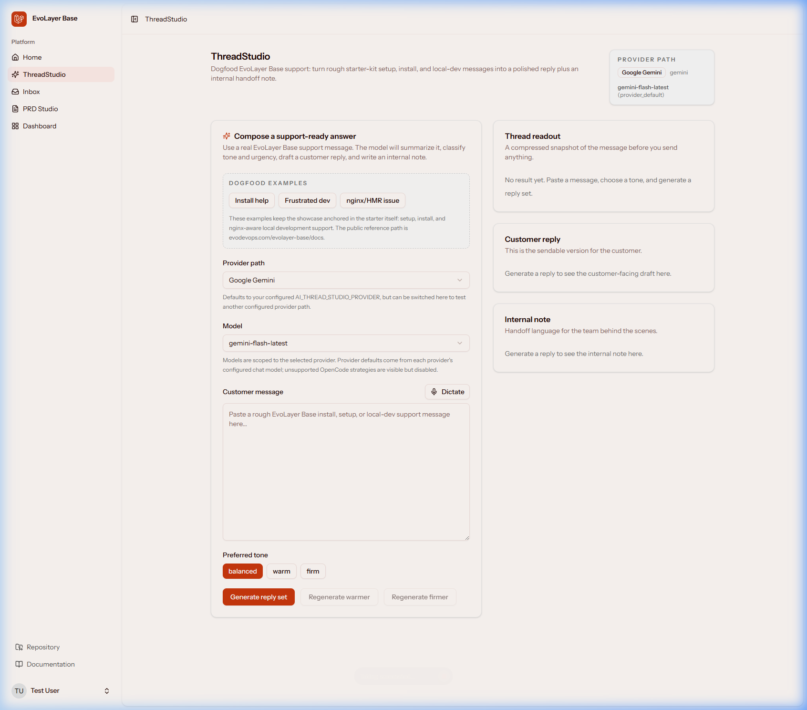

<p align="center">
  
</p>


# EvoLayer Base

**A fully working AI application layer for the official Laravel AI SDK.**
Structured-output streaming, ontology-driven events, and production-ready React surfaces — delivered as a project template.

<p align="center">
  <a href="https://github.com/xuple/evolayer-base-starter/actions"></a>
  <a href="https://packagist.org/packages/xuple/evolayer-base-starter"></a>
  <a href="https://packagist.org/packages/xuple/evolayer-base-starter"></a>
  <a href="LICENSE"></a>
</p>

<p align="center">
  <a href="https://evodevops.com/evolayer-base/docs">Documentation</a> ·
  <a href="#quick-start">Quick Start</a> ·
  <a href="https://github.com/xuple/evolayer-base">Package Repo</a> ·
  <a href="https://www.youtube.com/@EvoDevOps">YouTube</a> ·
  <a href="CHANGELOG.md">Changelog</a>
</p>

> **Developer preview:** Both `xuple/evolayer-base` and `xuple/evolayer-base-starter` are public, MIT-licensed, pre-1.0 packages on GitHub and Packagist. The current public install line is starter `v0.1.15` with `xuple/evolayer-base` `v0.1.7`.

## The Promise

EvoLayer Base gives you the best of both worlds: a clean, manageable starting point with continuous upstream updates, and the freedom to take total control exactly when you need it. It is a **working AI application layer delivered through a project template**.

- **You own** your routes, models, config, branding, and any surface you [eject](https://evodevops.com/evolayer-base/docs/how-to/eject-a-surface).
- **The application layer manages** the complex AI runtime, ontology, commands, and example surfaces behind the scenes. It keeps them updated automatically via [`composer evolayer:resync`](https://evodevops.com/evolayer-base/docs/how-to/resync-the-frontend) so your codebase stays clean.
- **Ejecting empowers you.** Whenever you want to deeply customize a managed surface, simply run `php artisan evolayer:eject <surface>`. You take full ownership of the code, and we'll step out of the way.

> Read the full [Promise](PROMISE.md) and [Framework Contract](https://github.com/xuple/evolayer-base/blob/main/docs/contract.md).

## Quick Start

```bash
composer create-project xuple/evolayer-base-starter my-app
cd my-app
npm install && npm run build
php artisan serve
```

`composer create-project` runs the post-create hook automatically — generating your app key, creating an SQLite database, running migrations and seeders, compiling the Wayfinder and ontology caches, and adding generated-app identity notes for humans and agents. Log in with `test@example.com` / `password` to explore every surface immediately.

> Cloned the repo directly? Run `composer setup` instead. Hosting behind Nginx? See [`docs/local-dev-hosting.md`](docs/local-dev-hosting.md). For generated-app identity behavior, see [`docs/migration/generated-app-identity.md`](docs/migration/generated-app-identity.md).

## Why EvoLayer Base?

- **[Structured AI Streaming](https://evodevops.com/evolayer-base/docs/how-to/configure-ai-provider)** — Real-time structured-output streaming via the `laravel/ai` SDK. Defaults to Gemini; the SDK also supports OpenAI, Anthropic, DeepSeek, Groq, xAI, Mistral, and Ollama. (ThreadStudio runtime-approves Gemini + OpenAI today — see [AI providers](#ai-providers).)

- **[Working AI Surfaces, Not Stubs](https://evodevops.com/evolayer-base/docs/tutorial/first-install)** — ThreadStudio, PRD Studio, AI contact triage, voice input, and inline text assist ship functional — not as placeholder wireframes.

- **[Ontology-Driven Events](https://evodevops.com/evolayer-base/docs/reference/sse-vocabulary)** — An `ontology.yaml` model compiles to typed SSE events and projections, giving your real-time UI a schema instead of ad-hoc event strings.

- **[Feature Flags, Not Bloat](https://evodevops.com/evolayer-base/docs/reference/env-flags)** — Every example surface toggles independently via `EVOLAYER_BASE_EXAMPLE_*` env flags. Disable what you don't need; routes and sidebar entries disappear.

- **[Reproducible Installs](PROMISE.md)** — Committed `composer.lock`, exact-pinned framework while `0.x`, deterministic `create-project`. Two installs of the same version are identical.

- **[Agent-Ready Tooling](https://laravel.com/docs/boost)** — Pre-wired for Claude Code, Codex, OpenCode, and Cursor via Laravel Boost with MCP, skills, and `search-docs`.

## Choose Your Path

|                    | Command                                                              | Use when…                                                                  |
| ------------------ | ------------------------------------------------------------------- | -------------------------------------------------------------------------- |
| 🚀 **New project** | `composer create-project xuple/evolayer-base-starter my-app`        | You want a fully configured app with every surface enabled from clone zero |
| 📦 **Existing app** | `composer require xuple/evolayer-base` then `php artisan evolayer:install` | You want to add AI and ontology to a Laravel app you already have           |

## How the pieces fit

|                                                                           | Owns                                                                                                              | Posture                                                         |
| ------------------------------------------------------------------------- | ----------------------------------------------------------------------------------------------------------------- | --------------------------------------------------------------- |
| [`xuple/evolayer-base`](https://github.com/xuple/evolayer-base) (package) | Examples, blocks, agents, ontology, `evolayer:*` commands, the `evolayer.base.*` config shape                     | Conservative — installs add no routes by default                |
| `xuple/evolayer-base-starter` (this repo)                                 | The Laravel host shell: Inertia/auth wiring, host migrations, `laravel/ai` patch, kitchen-sink `.env.example`, CI | Kitchen-sink — every example feature switched on out of the box |

It gives you a full Laravel application from day one — auth, host Inertia pages, React components, Tailwind styling, EvoLayer-published examples, config, seeders, and tests are all available to adapt. (Note: The starter is built on the foundation of the official `laravel/react-starter-kit`.)

> **Framework Contract**: For the strict definition of what the framework manages versus what you own, see the [EvoLayer Framework Contract](https://github.com/xuple/evolayer-base/blob/main/docs/contract.md) in the upstream package.

## Features

Each bundled example surface is gated by an `EVOLAYER_BASE_EXAMPLE_*` flag in `.env`; substrate features use the `EVOLAYER_BASE_FEATURE_*` prefix. Set a flag to `false` to drop that surface's routes and sidebar entry.

| Flag                                        | What it adds                                               |
| ------------------------------------------- | ---------------------------------------------------------- |
| `EVOLAYER_BASE_EXAMPLE_MARKETING_PAGES`     | Public About and authenticated Home launcher pages         |
| `EVOLAYER_BASE_EXAMPLE_THREAD_STUDIO`       | ThreadStudio — streaming AI compose with structured output |
| `EVOLAYER_BASE_EXAMPLE_PRD_STUDIO`          | PRD Studio — turn notes into scoped requirements           |
| `EVOLAYER_BASE_EXAMPLE_ADMIN_INBOX`         | Admin inbox for contact-form submissions                   |
| `EVOLAYER_BASE_EXAMPLE_CONTACT_AI`          | AI-assisted contact form (triage, auto-tagging)            |
| `EVOLAYER_BASE_EXAMPLE_VOICE_INPUT`         | Voice-input block                                          |
| `EVOLAYER_BASE_EXAMPLE_AI_TEXT_FIELD`       | `<AiTextField>` block — inline streaming suggestions       |
| `EVOLAYER_BASE_FEATURE_CONTACT_ATTACHMENTS` | Contact-form attachment processing (uses medialibrary)     |

## AI providers

EvoLayer Base uses the `laravel/ai` SDK for structured-output streaming. It defaults to **Gemini**, but supports a vast ecosystem including OpenAI, Anthropic, DeepSeek, Groq, xAI, Mistral, and Ollama. To enable AI features, set your provider's API key in `.env` (`GEMINI_API_KEY`, `OPENAI_API_KEY`, `ANTHROPIC_API_KEY`, etc.), then verify structured streaming works end to end:

```bash
php artisan evolayer:ai:stream-check gemini
```

> **Provider status:** ThreadStudio's runtime-approved (directly-verified) providers are
> **Gemini** (default) and **OpenAI** — both pass `evolayer:ai:stream-check` end to end
> with the committed `laravel/ai` patch, and only these two are selectable as
> `AI_THREAD_STUDIO_PROVIDER`. Anthropic's structured-streaming path currently returns
> zero `TextDelta` events and an empty final payload, so it is
> **diagnostic-eligible but blocked for ThreadStudio runtime / pending
> re-verification** — exercise it with `evolayer:ai:smoke-test anthropic` (the
> non-streaming path passes), but it is not runtime-approved for selection.
> NVIDIA / OpenCode / OpenRouter are likewise router-backed diagnostic-eligible
> probe candidates, not runtime-approved. See [`patches/README.md`](patches/README.md)
> for the verification matrix.

## The `laravel/ai` patch

The starter ships `patches/laravel-ai-structured-streaming.patch`, applied automatically via `cweagans/composer-patches` on `composer install`. It enables structured-output streaming until upstream `laravel/ai` ships the fix. See [`patches/README.md`](patches/README.md) for the rationale and upstream-PR tracking.

If streaming misbehaves, run `php artisan evolayer:doctor` — it verifies the patch marker along with the rest of the install.

## Re-syncing the package frontend

The EvoLayer React stubs are committed so the repo clones and builds without a publish step. To pull a newer `xuple/evolayer-base` release:

```bash
composer update xuple/evolayer-base
composer evolayer:resync
```

`evolayer:resync` is manifest-safe — it updates pristine stubs, keeps host-modified ones, and skips ejected surfaces (`--force` to overwrite local edits, `--dry-run` to preview). **Do not edit files under `vendor/xuple/evolayer-base`.** Fix package internals [upstream](https://github.com/xuple/evolayer-base), then `composer update` + `composer evolayer:resync` here.

To add Base to an existing app instead, use `php artisan evolayer:install` — you don't need that command in this starter, its work is already pre-applied.

## What's pre-applied

The package publishes most of its surface, but a few edits must live in host files. These are already applied:

- **Middleware** — shares the `evolayer.base.{examples,features,brand}` Inertia prop via `EvoLayerProps::base()`.
- **User model** — adds Spatie `HasRoles` for the admin gate.
- **Sidebar** — renders enabled example pages via `useExampleNavItems()`.
- **Types** — types the `evolayer` shared prop.
- **Seeders** — seeds the AI capability ledger and admin demo user.
- **Spatie migrations** — committed with ULID-compatible morph columns for EvoLayer models.

## Social previews

Public preview defaults live in `config/site.php`, controlled by `SITE_*` and `SOCIAL_*` variables in `.env`. Public pages use `PublicLayout` / `SiteHead` for title, canonical, robots, Open Graph, X/Twitter, and JSON-LD. See [`.env.example`](.env.example) for the full set.

Two opt-in knobs (blank by default, so output is unchanged until set):

- **Local-business structured data** — set `SITE_JSONLD_TYPE` (one or more schema.org types, comma-separated) with optional `SITE_JSONLD_TELEPHONE` / `_EMAIL` / `_AREA_SERVED` / `_PRICE_RANGE` / `_SAME_AS` to emit a server-rendered business node in the JSON-LD graph.
- **Asset cache-busting** — set `SITE_ASSET_VERSION` and wrap public asset paths with the `useVersionedAsset()` hook to append a global `?v=` token, so replaced images are picked up past a CDN.

## Tooling

- `composer dev` — run server, queue, logs, and Vite together.
- `php artisan evolayer:doctor` — health-check the install.
- `npm run types:check` / `npm run build` (client + SSR) / `composer lint` / `composer test`.
- [`docs/local-dev-hosting.md`](docs/local-dev-hosting.md) — Nginx/PHP-FPM hosted-dev checklist, `tempnam()` troubleshooting, and env-driven Vite port/origin HMR guidance.

The starter is pre-wired for AI coding agents (Claude Code, Codex, OpenCode, Cursor) via [Laravel Boost](https://laravel.com/docs/boost): `AGENTS.md` / `CLAUDE.md` carry the starter-specific boundaries followed by Boost's framework guidelines, and `.mcp.json` / `.codex/config.toml` / `opencode.json` register `php artisan boost:mcp`. Skills live under `.claude/skills/` and `.agents/skills/`. **Boost is a `require-dev` dependency**; the MCP layer is only available with dev dependencies installed.

The test runner is **Pest 4** (`php artisan test`), layered on PHPUnit 12. New tests use Pest's `it()` / `test()` style (`php artisan make:test --pest {name}`); existing PHPUnit `Tests\TestCase` classes still run under Pest, so migration is opportunistic.

## Where this sits in the EvoDevOps family

EvoLayer Base is the **AI / ontology / blocks substrate**: a Laravel + Inertia + React layer that turns the [`laravel/ai`](https://github.com/laravel/ai) SDK into a structured-output streaming surface, with an `ontology.yaml`-driven event/projection model and a small block library on top. This starter is the `composer create-project` entry point for Base. The package itself is [`xuple/evolayer-base`](https://github.com/xuple/evolayer-base) under the `evolayer.base.*` config and route namespace.

Sibling EvoDevOps layers (`evolayer.commerce.*`, `evolayer.saas.*`, `evolayer.rls.*`, …) are planned as separate packages with their own starter repos following the same pattern; they will not ship inside this Base starter. `evodevops.com` is the editorial / teaching home for the family; `evodevops.com/evolayer-base/docs` is the canonical Base documentation root.

## Project Status

EvoLayer is pre-1.0. Base and the starter are free/public MIT projects published on GitHub and Packagist. See [RELEASE.md](RELEASE.md) and [CHANGELOG.md](CHANGELOG.md).

---

<p align="center">
  Built on the <a href="https://laravel.com/docs/starter-kits">Laravel React Starter Kit</a> · Licensed under <a href="LICENSE">MIT</a>
</p>
